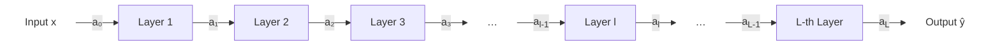
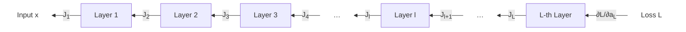
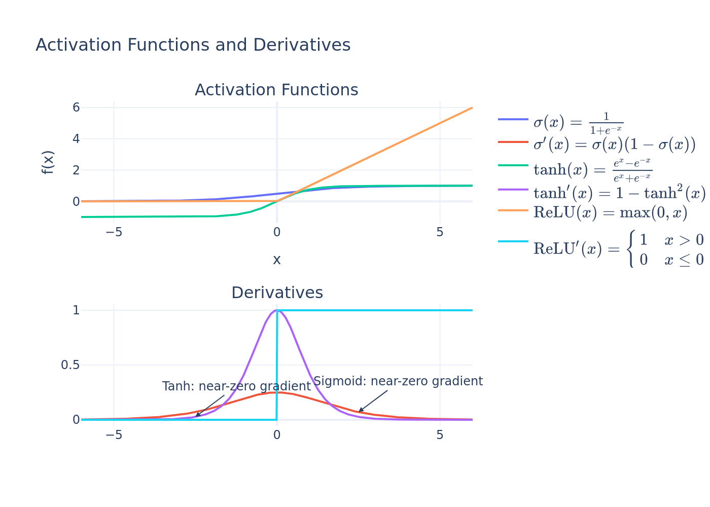
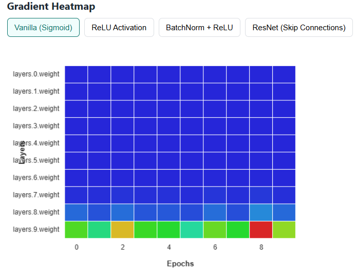
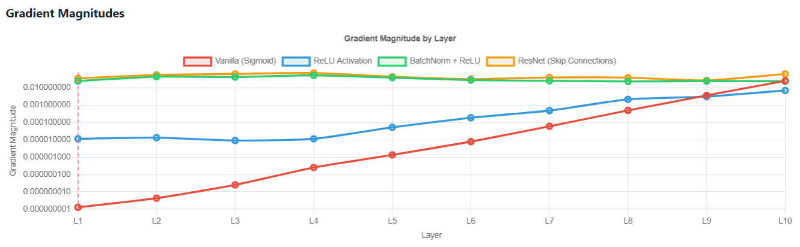
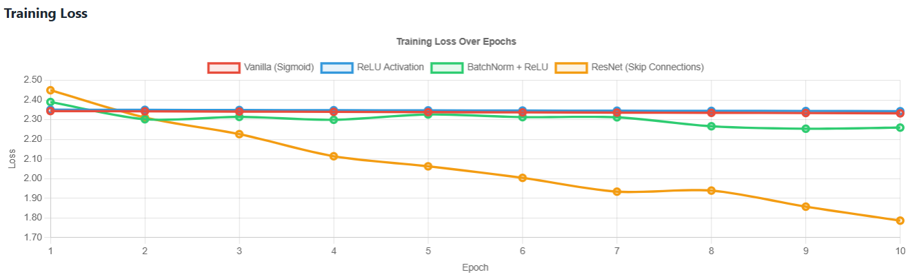
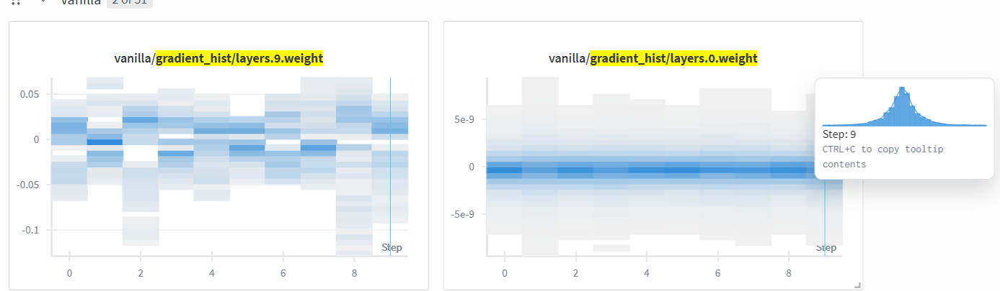

<!-- <style>
  ques { background-color: red; color: white; padding: 1px; border-radius: 2px; }
  note { background-color: yellow; color: black; padding: 1px; border-radius: 2px; }
  imp { background-color: lightgreen; color: black; padding: 1px; border-radius: 2px; }
  underline1 { text-decoration: underline; }
</style> -->
# Vanishing Gradients: Four Ws and One H <!-- omit in toc -->

A walkthrough of why gradients vanish, how to spot them, and which well-established ideas help us keep training signals alive.

- Prerequisites: Basic deep learning concepts (as I am not defining some of the concepts here)
- Visualization web app: [Hugging Face Space](https://huggingface.co/spaces/hvinay/<>)
- Medium article: [Vanishing Gradients on Medium](https://medium.com/<>)

## Table of Contents <!-- omit in toc -->
- [What it is](#what-it-is)
  - [Intuitive Understanding](#intuitive-understanding)
  - [Mathematical View](#mathematical-view)
- [Why it exists](#why-it-exists)
- [Where/When it is observed](#wherewhen-it-is-observed)
- [How](#how)
  - [To Detect](#to-detect)
  - [To Mitigate](#to-mitigate)

## What it is

The term "vanishing gradients" names a training bottleneck. It happens when backpropagated partial derivatives shrink exponentially as they traverse a deep network (see Figure 1), starving early layers of learning signal. If we track the computation graph from input to output, we see repeated multiplications by numbers smaller than one. By the time the gradient reaches the first layers, it can be so tiny that parameters barely update.


**Figure 1:** L-layer network

### Intuitive Understanding

Before diving into equations, it helps to visualize what happens if every layer scales the incoming gradient by some constant smaller than one. Imagine each layer receives a gradient as input (the "backpropagated" gradient from the layer above - See Figure 2), and simply multiplies it by a scalar $c$ with $|c| < 1$. After passing through $n$ layers:

```math
\text{Gradient at layer 0} = (\text{Gradient at output}) \times c^n
```

For example, if $c = 0.5$ and $n = 10$, then $c^n = 0.5^{10} \approx 0.001$ — a thousand-fold reduction! This is why, with even modestly deep networks, gradients can shrink exponentially fast. With that picture in mind, the chain-rule derivation in the next subsection should feel less abstract.


**Figure 2**: Backpropagation. Each layer transmits gradients backward via its Jacobian. 

### Mathematical View

The formal view matches the intuition: multiplying many Jacobians whose singular values are below one shrinks the overall gradient. This subsection is <b>not essential</b> for using neural networks, but it helps build intuition for the vanishing gradients problem.

When each layer contributes a Jacobian with singular values < 1, their product collapses toward zero, freezing earlier layers. To see this, we write gradients with respect to parameters (using the chain-rule, see Eq. 6.46<sup>[3]</sup>)

```math
\frac{\partial \mathcal{L}}{\partial \mathbf{W}_l} =
 \left(\frac{\partial \mathbf{a}_l}{\partial \mathbf{W}_l}\right)^\top
\frac{\partial \mathcal{L}}{\partial \mathbf{a}_l}
```

Gradients $\frac{\partial \mathbf{a}_l}{\partial \mathbf{W}_l}$ and $\frac{\partial \mathcal{L}}{\partial \mathbf{a}_l}$ are column vectors. The gradient with respect to hidden activations at layer $l$ is: (by applying the chain rule)

```math
\frac{\partial \mathcal{L}}{\partial \mathbf{a}_l} =
\left( \prod_{k=l+1}^{L} \mathbf{J}_k^\top \right)
\frac{\partial \mathcal{L}}{\partial \mathbf{a}_L},
\quad \text{where }\mathbf{J}_k = \frac{\partial \mathbf{a}_k}{\partial \mathbf{a}_{k-1}}
```

Here, Jacobian $\mathbf{J}_k = \frac{\partial \mathbf{a}_k}{\partial \mathbf{a}_{k-1}}$ is a matrix with entry $(i,j)$ representing $\frac{\partial a_{k,i}}{\partial a_{k-1,j}}$. This means we multiply successive Jacobians as we backpropagate from output layer $L$ to layer $l$. Taking (spectral) norm gives:

```math
\left\|\frac{\partial \mathcal{L}}{\partial \mathbf{W}_l}\right\|
= \left\|
 \left(\frac{\partial \mathbf{a}_l}{\partial \mathbf{W}_l}\right)^\top
\left( \prod_{k=l+1}^{L} \mathbf{J}_k^\top \right)
\frac{\partial \mathcal{L}}{\partial \mathbf{a}_L}
\right\|
\le
\left\| \frac{\partial \mathbf{a}_l}{\partial \mathbf{W}_l} \right\|
\left\| \prod_{k=l+1}^{L} \mathbf{J}_k^\top \right\|
\left\|\frac{\partial \mathcal{L}}{\partial \mathbf{a}_L}\right\|
```

If both $\left\| \frac{\partial \mathbf{a}_l}{\partial \mathbf{W}_l} \right\|$ and $\left\|\frac{\partial \mathcal{L}}{\partial \mathbf{a}_L}\right\|$ remain bounded, and every $\|\mathbf{J}_k\| < 1$, then the product of Jacobians contracts toward zero. As a result, gradients with respect to early activations $\mathbf{a}_l$ or parameters $\mathbf{W}_l$ also approach zero ("vanish").

For a feedforward network (ignoring the bias term) with activation $h(\cdot)$ <sup>[4]</sup>,

$$\mathbf{a}_l = h(\mathbf{z}_l) = h(\mathbf{W}_l \mathbf{a}_{l-1})$$
<!-- $W_l \sim m \times n; a_{l-1} \sim n \times 1 \implies z_l \sim m \times 1 \implies a_{l}=h(z_l) \sim m \times 1 \implies \text{diag}(h(z_l)) \sim m \times m$

$\operatorname{diag}\left(h'(\mathbf{z}_l)\right) \cdot \mathbf{W}_l \sim m \times n$ -->

```math
\frac{\partial \mathbf{a}_l}{\partial \mathbf{a}_{l-1}} = 
\frac{\partial h(\mathbf{W}_l \mathbf{a}_{l-1})}{\partial \mathbf{a}_{l-1}}
= \operatorname{diag}\left(h'(\mathbf{z}_l)\right) \cdot \mathbf{W}_l
```
$h'(\mathbf{z}_l)$ is a vector of derivatives applied elementwise. So the spectral norm

```math
\left\| \frac{\partial \mathbf{a}_l}{\partial \mathbf{a}_{l-1}} \right\| \leq \|\mathbf{W}_l\| \cdot \|\operatorname{diag}(h'(\mathbf{z}_l))\|
```
where $\|\mathbf{W}_l\|$ is its largest singular value and $\|\operatorname{diag}(h'(\mathbf{z}_l))\|$ is the maximum of $|h'(z_{l,i})|$ over activations.

$$
\left\| \frac{\partial \mathcal{L}}{\partial \mathbf{W}_l} \right\| \propto 
\left\| \prod_{k=l+1}^{L} \frac{\partial \mathbf{a}_k}{\partial \mathbf{a}_{k-1}} \right\| 
\leq 
\prod_{k=l+1}^{L} \| \mathbf{W}_k \| \prod_{k=l+1}^{L} \| \text{diag}\left( h'(\mathbf{z}_k) \right) \| 
= \prod_{k=l+1}^{L} \sigma_{k}^{W} \cdot \sigma_{k}^{h'}
$$

With singular values $\sigma_k^W < 1$, gradients quickly shrink toward zero. This connects the math directly to the earlier intuition: multiply enough sub-unit singular values and the product collapses.

## Why it exists

Now that we have both the picture and the math, the root causes line up cleanly.

<div align="center">
  
  <div style="margin-top:6px; font-size: 1em;">
    Figure 3: tanh/sigmoid and its gradients have near-zero derivatives when |x| &gt;&gt; 0.
  </div>
</div>

<br>

1. **Saturating non-linearities**: sigmoid/tanh squash inputs into flat regions with near-zero derivatives (as in the bottom subplot of Figure 3) when $|x| \gg 0$. If most activations live there, their Jacobians contribute tiny factors to the product.
2. **Poor initialization**: Small random weights yield Jacobians with spectral norms below one. Xavier/Glorot initialization showed analytically (simple derivation) that choosing variance `2/(fan_in + fan_out)` balances forward/backward signal flow in tanh networks<sup>[1]</sup>.
3. **Deep compositions**: Each extra layer multiplies the gradient by another contraction.

## Where/When it is observed

Vanishing gradients show up in familiar architectures when those causes pile up. The examples below highlight when to expect trouble.

<div align="center" style="margin: 1.5em 0;">
  
  <div style="margin-top: 8px; font-size: 1em;">
    Figure 4: Layer-wise gradient heatmap - Gradients are not propagated (marked blue) to earlier layers (layers 0, 1, ...) compared to layer 9 (marked non-blue)
  </div>
</div>

- **Sequence Models**: Vanilla RNNs lose dependencies beyond a few steps without gating because the same Jacobian is multiplied many times.
- **Very deep CNNs**: Early VGG-style stacks (>16 conv blocks) saturate without careful initialization.
- **Generative Diffusion**: Score networks with long U-Net backbones suffer when skip connections are absent or poorly normalized.

Spotting these patterns in familiar architectures helps you predict when gradients might fade before you even plot anything, which sets up the monitoring steps below.

## How

### To Detect

<div align="center" style="margin-bottom: 1.7em;">
  
  <div style="margin-top: 6px; font-size: 1em;">
    Figure 5: Layer-wise gradient magnitude - For tanh/sigmoid, Earlier layers have small gradient magnitudes in comparison to later layers
  </div>
</div>

<div align="center" style="margin-bottom: 1.7em;">
  
  <div style="margin-top: 6px; font-size: 1em;">
    Figure 6: Loss for networks with sigmoid/tanh plateaus quickly
  </div>
</div>

<div align="center" style="margin-bottom: 1.7em;">
  
  <div style="margin-top: 6px; font-size: 1em;">
    Figure 7: Gradient Norm Histogram: Gradients are clustered around 0 for layer 0 in comparison to layer 9
  </div>
</div>

- **Layer-wise gradient norms**: plotting the average gradient norm (e.g., $\|\frac{\partial \mathcal{L}}{\partial \mathbf{W}_l}\|$ or its log) for each layer versus depth is a standard way to check for vanishing gradients. A sharp downward trend as you move to earlier layers (see Figure 5) strongly indicates vanishing gradients, so this should be one of the first diagnostics you run.
- **Gradient norm histograms**: Log per-layer $\frac{\partial \mathcal{L}}{\partial \mathbf{W}_l}$. Vanishing gradients show up as a central spike at zero (for layer 0) with rapidly decreasing probability for larger values (see Figure 7). Comparing early and late layers side by side makes the contrast obvious.
- **Loss plateauing**: Monitor the training and validation loss curves for early and sustained plateaus; a flat loss curve (see Figure 6) while training indicates that gradients may not be propagating effectively, often due to vanishing gradients. However, note that plateauing loss can also occur for reasons other than vanishing gradients, such as learning rate issues or poor data/model fit. 
- **Activation watchpoints**: Track the percentage of neurons in saturation (sigmoid > 0.99 or < 0.01).
<!-- - **Layer-wise learning curves**: <ques>Plot CKA</ques> or representation similarity across epochs; frozen layers barely move. -->

If several of these indicators line up, it is a strong signal that gradients are dying out and that you should move from diagnosis to mitigation.

### To Mitigate

1. **Careful Weight Initialization**: Use Xavier/Glorot initialization<sup>[1]</sup> (variance `2/(fan_in + fan_out)`) for tanh or linear activations, and Kaiming/He initialization<sup>[2]</sup> (variance `2/fan_in`) for ReLU. 
2. **Non-saturating activations**: Switch to ReLU, GELU, or Swish. They avoid flat regions, so gradients retain usable magnitude.
3. **Residual/skip connections**: Permit gradients to bypass deep stacks (`y = F(x) + x`). This short-circuits long chains of contractions.
4. **Normalization**: BatchNorm, LayerNorm, or RMSNorm stabilize scale; use Pre-LN Transformers as the normalization occurs within the sub-layer path and not directly on the main residual path, the gradients can pass through this skip connection to the preceding layers and the initial embeddings with less attenuation. Normalization keeps activations in a range where derivatives are healthy.
5. **Gradient clipping & scaling**: Use gradient clipping to prevent gradients from exploding, and adaptive optimizers (such as Adam) to scale small gradients.
6. Research offers additional techniques to maintain reasonable Jacobian norms so signals do not vanish as they travel backward.
<!-- 7. <ques>**Curriculum or shorter unrolls**: In RNNs, truncated BPTT shortens gradient paths during early training.</ques> -->

---

**References**

1. Glorot, X. & Bengio, Y. (2010). *Understanding the difficulty of training deep feedforward neural networks*. Proceedings of the Thirteenth International Conference on Artificial Intelligence and Statistics, 249–256.
2. He, K., Zhang, X., Ren, S., & Sun, J. (2015). *Delving Deep into Rectifiers: Surpassing Human-Level Performance on ImageNet Classification*. Proceedings of the IEEE International Conference on Computer Vision (ICCV), 1026–1034.
3. Goodfellow, I., Bengio, Y., & Courville, A. (2016). *Deep Learning*. MIT Press. (See especially Section 6.5 on backpropagation.)
4. UVADLC, "Part 2: Vanishing and Exploding Gradients," Lecture 5. [Online]. Available: https://uvadlc.github.io/lectures-nov2020.html
